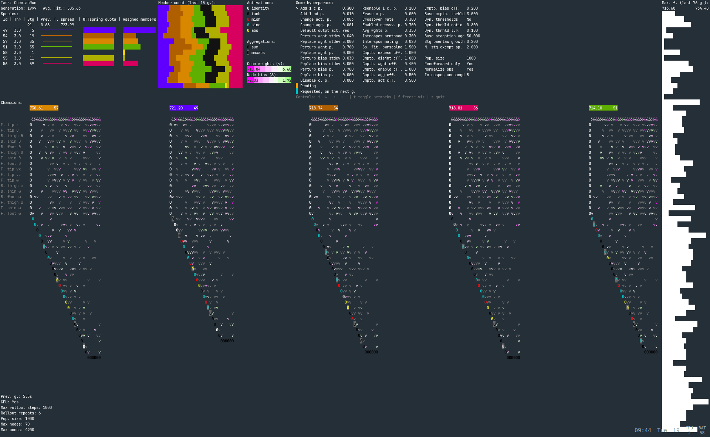

"Neuro Evolution of Augmented Topologies" JAX implementation.




# Installation:

Clone the repository and install the `requirements.txt`.

The TUI server requires `protobuf`, `protoc-gen-go`, `protoc-gen-go-grpc`

# Usage:

```bash
python -m examples.train_<example>

# Common flags:
#   --hparams KEY=VALUE       NEAT hyperparams 
#   --generations=<int>
#   --visualize-training      Send real-time training data to the TUI.
# Examples:
#   python -m examples.train_gaussian --hparam feedforward=True --hparam perturb_wght_stdev=0.1 
#   python -m examples.train_gaussian --visualize-training --generations=200
```

### Visualization TUI

```bash
training_visualizer/generate_grpc.sh
cd training_visualizer
go run .
```

# File Structure:

`src/data.py`, `src/hyperparams.py`: Main files defining the data for the algo and the policy, and the initialization.

`src/solver.py` : High level logic of the neat algorithm.
                  Abides by evojax's `ask`-`tell` and `best_params` api; in this way evojax handles the algo-policy-task loop.

`src/algo/` : The different chunks of the neat algorithm.

`src/policy.py` : The functions used for the forward pass, both for the recurrent and feedforward-only settings.

`src/topological_sorting.py` : For preparing the forward pass data when using the feedforward only setting.                                                  

`tasks/`: Environments for the individuals to run against.

### TUI

`training_visualizer/server.go` : Go program that renders the visualizations in the terminal using a library called tcell. Abides by `training_visualizer/grpc_api/schema.proto`.

`training_visualizer/sugiyama.go` : Exposes a function, used in `server.go`, that renders networks through the Sugiyama method. Unfinished prototype.

`training_visualizer/grpc_api/schema.proto`: Defines the data to send. Alludes to `src/data.py`, `src/hyperparams.py`.

`src/extra_modules/training_visualizer/client.py` : Prepares and sends the data to `training_visualizer/server.go`.

`**.pb.go`, `**pb2.py`, `**pb2_grpc.py`: Autogenerated files.

# Acknowledgments:

- [**EvoJAX**](https://github.com/google/evojax): Orchestrates the rollout loop, and provides utils.

- [**tcell**](https://github.com/gdamore/tcell): The TUI was made with this library.

Tasks:

- [**Mujoco Playground**](https://github.com/google-deepmind/mujoco_playground)

- [**gymnax**](https://github.com/RobertTLange/gymnax)

Sources of ideas:

- **Stanley, K. O., & Miikkulainen, R. (2002).** [Evolving Neural Networks Through Augmenting Topologies](https://doi.org/10.1162/106365602320169811) *Evolutionary Computation, 10*(2), 99-127.
- **Buckland, M.** *AI Techniques for Game Programming.*
- **Risi, S., Tang, Y., Ha, D., & Miikkulainen, R.** [*Neuroevolution: Harnessing Creativity in AI Agent Design*](https://neuroevolutionbook.com/). MIT Press.
- **Sugiyama, K.** *Graph Drawing and its Applications for Software and Knowledge Engineers.*
- **Kindermann, P.** [Lectures on Visualization of Graphs](https://www.youtube.com/playlist?list=PLubYOWSl9mIvxe_HwoSyT-oXgkOmB1u3V).

- [**neat-c**](https://nn.cs.utexas.edu/?neat-c)
- [**NEAT-Python**](https://github.com/codereclaimers/neat-python)
- [**TensorNeat**](https://github.com/emi-group/tensorneat)

# License

TuiNEAT source-available license

You may use it commercially if your company does not surpass the monetary thresholds in (Clause C),
otherwise it must reach a separate agreement.
It also contains a clause on redistribution.
Beware this is not an OSI-approved license.

# Contributing

See `CONTRIBUTING.md`, `LICENSE.md`.

# Roadmap

- [ ] Finish recurrent examples
- [ ] Benchmark against top alternatives and showcase results
- [ ] Finish TUI: Sugiyama view
- [ ] Finish TUI: Handle both feedforward and recurrent networks
- [ ] Support `jax.shard_map` (Replace EvoJAX (archived) with own rollout loop)

#### Maybe

- [ ] Finish tests
- [ ] Finish multiagent example
